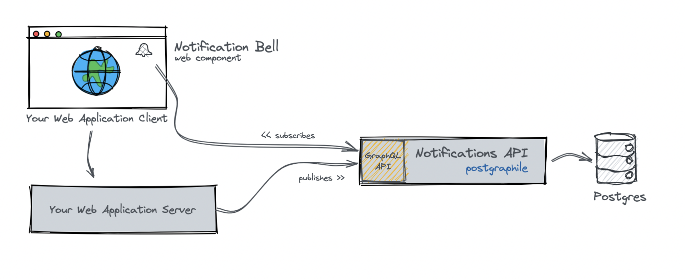

import Callout from 'nextra-theme-docs/callout'
import Bleed from 'nextra-theme-docs/bleed'

# Get Started

## Quick Start

Notifir has two main components:
* API ([notifications-api](https://github.com/notifir/notifications-api))
* Web component ([wc-notification-bell](https://github.com/notifir/wc-notification-bell))

You can see how do they map together on the diagram below:

<Bleed></Bleed>

## API

Notifications API provides [GraphQL APIs](https://graphql.org/) for publishing and reading notifications. Service is written in NodeJS and uses [Postgraphile](https://www.graphile.org/postgraphile/), which automatically generates GraphQL API for the Postgresql database. The access rights for the notifications data are enforced on the DB level. Read more here.

Setting up [notifications-api](https://github.com/notifir/notifications-api).

1. Clone (or fork) [repository](https://github.com/notifir/notifications-api).

2. You need to run Postgres to store your notifications and make API work. For example, you can run it in a docker container:

```shell
docker pull postgres
docker run --name postgres -e POSTGRES_USER=postgres -e POSTGRES_PASSWORD=postgres -p 5432:5432 -d postgres
```

<Callout>
  You can connect to the existing database or run Postgres in another way, but please ensure that `DB_*` environment variables are correct in the `.env` file.
</Callout>

3. Once you have Postgres running you need to apply DB-patches to create schema. You can also generate some test data using `npx knex seed:run` (optional).

```shell
npx knex migrate:latest
npx knex seed:run
```

You can connect to the Postgres and check that the schema (and data) is there.

4. You are good to go! Run `yarn start` to start or you can use `yarn watch` while developing locally.

```shell
yarn
yarn watch
```

<Callout>
  Once you have the API running, you can explore the GraphQL APIs using `graphiql`, which is enabled by default and served at [https://localhost:3001/api/graphiql](https://localhost:3001/api/graphiql)
</Callout>

## Web Component

Notification bell is a simple web component created using [Lit](https://lit.dev), which can be consumed by vanilla JS or any front-end framework. Read more here.

Setting up [wc-notification-bell](https://github.com/notifir/wc-notification-bell).

1. (optional) Clone (or fork) [repository](https://github.com/notifir/wc-notification-bell).

2. (optional) Run `yarn dev` to start the demo page locally.

<Callout>
  If you haven't changed the port configuration for API, demo page widget should automatically connect to the API.
</Callout>

3. Integrate widget into your web application.

You can install notification web component to your project using NPM:

```bash
npm i wc-notification-bell
```

You can integrate it either into your HTML page or some component based on the framework you use.

```html
<!-- cdn -->
<script
  type="module"
  src="https://cdn.jsdelivr.net/npm/wc-notification-bell@latest"
></script>

<notification-bell mock></notification-bell>
```


```ts
import 'wc-notification-bell'

...

<notification-bell mock></notification-bell>
```

<Callout>
  You can find the available configuration arguments in the Web Component section.
</Callout>

---

<span id="sidebar-and-anchor-links" />
